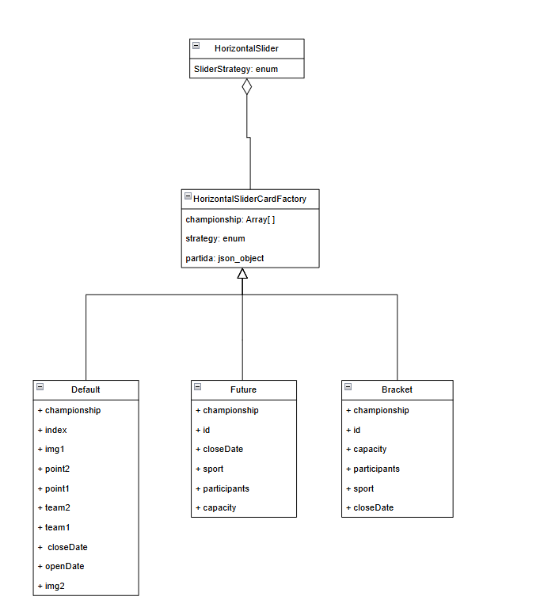

# 3.3. Módulo Padrões de Projeto GoFs Comportamentais

## Introdução

Os Padrões de Projeto GoF Comportamentais servem como guia no projeto, promovendo uma construção organizada, ao estruturar soluções reutilizáveis e claras para problemas recorrentes.

## Metodologia

O grupo foi dividido em três subgrupos, cada um responsável pela elaboração de um padrão criacional, estrutural e comportamental, totalizando três de cada tipo. Assim, o grupo se organizou para implementar um padrão de cada categoria do GoF.A produção dos padrões foi feita no software [draw.io](https://www.drawio.com/), que é uma ferramenta colaborativa online para criação de Diagramas.

## Strategy

### Uso

O Strategy permite definir diferentes maneiras de realizar uma tarefa, organizando cada método separadamente e facilitando a troca entre eles.

### Diagrama-Front End
<center>

<font size="2"><p style="text-align: center">Figura 1: strategy </p></font>




<font size="2"><p style="text-align: center">Autores: [Flávio Melo](https://github.com/flavioovatsug), [Oscar de Brito](https://github.com/OscarDeBrito),  [Christian](https://github.com/crstyhs), [Caio Sulz](https://github.com/CaioSulz), [Italo Bruno](https://github.com/ItaloBrunoM) e [Fabrício](https://github.com/FabricioDeQueiroz) </p></font>

<br>


</center>

### Implementação-Front End
```typescript
export enum SliderStrategy {
    default,
    future,
    bracket,
}
...
 <ul className="list-none w-[100vw] lg:px-3 lg:pt-3 lg:pb-1 p-1.5 overflow-x-auto whitespace-nowrap scroll-smooth scrollbar-thumb-navbar-secondary-btn-hover scrollbar-track-transparent scrollbar-thin snap-x snap-mandatory">
                {filteredChampionships.length != 0 ? filteredChampionships.map((championship: any) => {
                    return (
                        championship.matches.map((partida: any) => {
                            return (CardFactory.createCard(strategy, championship, partida))
                        })
                    )
                }) : (
                    <li key={0}
                        className="mt-1 flex flex-col justify-center items-center w-[95vw] justify-self-center bg-transparent rounded-[10px] border-2 border-primary-btn-base">
                        <div className="flex flex-col justify-center lg:h-[30vh] h-[25vh] text-primary-btn-hover lg:text-3xl text-xl">
                            <p>Nenhum campeonato no momento...</p>
                        </div>
                    </li>
                )}
            </ul>
...
```
<br>

### Utilização do Horizontal Slider com Strategy

```typescript
return (
    <div className="min-h-screen bg-gray-100 dark:bg-gray-900 mt-32 mb-10 flex flex-col gap-y-10">
        <HorizontalSlider
            title={"Campeonatos em Equipe"}
            championships={championships}
            color={SliderColors.light}
            strategy={SliderStrategy.default}
        />
        <HorizontalSlider
            title={"Campeonatos Individuais"}
            championships={championships}
            color={SliderColors.light}
            strategy={SliderStrategy.bracket}
        />
        <HorizontalSlider
            title={"Campeonatos Futuros"}
            championships={championships}
            color={SliderColors.dark}
            strategy={SliderStrategy.future}
        />
    </div>
);
```

A aplicação do _Strategy_ permitiu que utilizássemos o mesmo Componente (HorizontalSlider), para criar três Componentes diferentes, sendo eles o Slider de Campeonatos em Equipe, Campeonatos Individuais e Campeonatos Futuros. Promovendo uma melhor organização e reutilização de código, e consequentemente, da manutenibilidade.

<br>

### Diagrama Back-End
<center>

<font size="2"><p style="text-align: center">Figura 1: strategy </p></font>


<font size="2"><p style="text-align: center">Autores: [Yan Werlley](https://github.com/YanWerlley), [Gustavo França](https://github.com/gustavofbs),  [Harry](https://github.com/harry-cmartin) </p></font>

<br>


</center>


### Implementação Back-End

Neste exemplo, o Strategy está sendo usado para definir e encapsular diferentes estratégias de validação e preparação de dados para o envio do formulário de criação de campeonatos.

```python
// Strategy Interface
interface ChampionshipStrategy {
  validateForm: (data: FormData) => { isValid: boolean; errors?: string[] };
  prepareSubmission: (data: FormData, teams: Team[]) => any;
}

// Simple Strategy - Basic Validation
const SimpleChampionshipStrategy: ChampionshipStrategy = {
  validateForm: (data: FormData) => {
    const errors: string[] = [];
    
    if (!data.name || data.name.length < 3) {
      errors.push('Nome deve ter pelo menos 3 caracteres');
    }
    if (!data.sport) {
      errors.push('Selecione um esporte');
    }
    if (!data.start_date) {
      errors.push('Data de início é obrigatória');
    }
    if (!data.teams || data.teams.length === 0) {
      errors.push('Selecione pelo menos um time');
    }

    return {
      isValid: errors.length === 0,
      errors
    };
  },
...

// Advanced Strategy - Strict Validation
const AdvancedChampionshipStrategy: ChampionshipStrategy = {
  validateForm: (data: FormData) => {
    const errors: string[] = [];
    
    if (!data.name || data.name.length < 5) {
      errors.push('Nome deve ter pelo menos 5 caracteres');
    }
    if (!data.description || data.description.length < 10) {
      errors.push('Descrição deve ter pelo menos 10 caracteres');
    }
    if (!data.sport) {
      errors.push('Selecione um esporte');
    }
    if (!data.start_date || !data.end_date) {
      errors.push('Datas de início e fim são obrigatórias');
    }
    if (data.start_date && data.end_date && new Date(data.start_date) >= new Date(data.end_date)) {
      errors.push('Data de início deve ser anterior à data de fim');
    }
    if (!data.teams || data.teams.length < 2) {
      errors.push('Selecione pelo menos dois times');
    }

    return {
      isValid: errors.length === 0,
      errors
    };
  },
  prepareSubmission: (data: FormData, teams: Team[]) => {
    const selectedTeamIds = data.teams.map(teamName => {
      const team = teams.find(t => t.name === teamName);
      return team ? team.id : null;
    }).filter(id => id !== null);

    return {
      name: data.name,
      description: ${data.description} (${SPORTS.find(s => s.id === parseInt(data.sport))?.name}),
      sport: parseInt(data.sport),
      start_date: data.start_date,
      end_date: data.end_date,
      teams: selectedTeamIds
    };
  }
};
...
```

### Arquivo Strategies.py

```python
...
from abc import ABC, abstractmethod
from datetime import timedelta
import random
class MatchGenerationStrategy(ABC):
    @abstractmethod
    def generate_matches(self, championship):
        pass
class BracketMatchStrategy(MatchGenerationStrategy):
    def generate_matches(self, championship):
        from matches.models import Match
        
        if not championship.teams.exists():
            return
        
        teams_list = list(championship.teams.all())
        random.shuffle(teams_list)
        groups = [teams_list[i:i+4] for i in range(0, 16, 4)]
        
        group_phase_days = (championship.end_date - championship.start_date).days // 2
        days_between_matches = group_phase_days // 6
        
        match_date = championship.start_date
        for group_num, group in enumerate(groups):
            for i, team1 in enumerate(group):
                for team2 in group[i+1:]:
                    Match.objects.create(
                        championship=championship,
                        team1=team1,
                        team2=team2,
                        match_date=match_date
                    )
                    match_date += timedelta(days=days_between_matches)
class PointsMatchStrategy(MatchGenerationStrategy):
    def generate_matches(self, championship):
        from matches.models import Match
        
        if not championship.teams.exists():
            return
            
        teams_list = list(championship.teams.all())
        total_rounds = len(teams_list) - 1
        matches_per_round = len(teams_list) // 2
        
        days_between_matches = (championship.end_date - championship.start_date).days // (total_rounds * matches_per_round)
        match_date = championship.start_date
        
        for round_num in range(total_rounds):
            for i in range(matches_per_round):
                team1 = teams_list[i]
                team2 = teams_list[-i-1]
                Match.objects.create(
                    championship=championship,
                    team1=team1,
                    team2=team2,
                    match_date=match_date
                )
                match_date += timedelta(days=days_between_matches)
            
            # Rotaciona os times para a próxima rodada
            teams_list.insert(1, teams_list.pop())
...
```

### Arquivo models.py

```python
...

    def generate_matches(self):
        """Gera todas as partidas do campeonato baseado no tipo"""
        from .strategies import BracketMatchStrategy, PointsMatchStrategy
        
        team_count = self.teams.count()
        if self.championship_type == 'bracket' and team_count == 16:
            self._generate_bracket_matches()
            strategy = BracketMatchStrategy()
        elif self.championship_type == 'points' and 10 <= team_count <= 20:
            self._generate_points_matches()
            strategy = PointsMatchStrategy()
        else:
            return
            
        strategy.generate_matches(self)


...
```


## Histórico de Versão

|Versão|Data|Descrição|Autor|Revisor| Detalhes da revisão |
|:----:|----|---------|-----|:-------:|-----| 
| 1.0 | 05/01/2024 | Criação do arquivo |  [Christian](https://github.com/crstyhs) |  | |
| 1.1 | 05/01/2024 | Adição da implementação |  [Christian](https://github.com/crstyhs) |  | |
| 1.2 | 05/01/2024 | Adição de imagens |[Christian](https://github.com/crstyhs)  |  | |
| 1.3 | 05/01/2024 | Adição Strategy BackEnd |[Yan Werlley](https://github.com/YanWerlley)  |  | |
|  1.4   | 05/01/2024 | Adição Explicação Strategy Frontend | [FabricioDeQueiroz](https://github.com/FabricioDeQueiroz) |  | |
